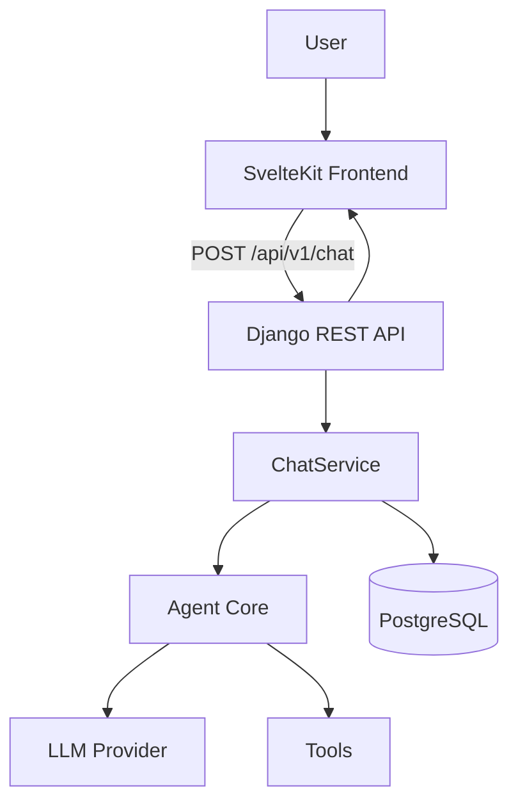

# SRE AI Agent

A small, production-minded demo of an AI agent for SRE/operations
questions. You ask about a service ("Why is payments failing?"), the agent
calls tools to look up its status, deployments, and error rate, and answers
using only what those tools returned.

Built to demonstrate: **Software Engineering + AI Agents + Cloud + SRE +
Security + CI/CD** — as a small application with production standards,
not a large one.

**Live demo:** https://frontend-israel-jesus-projects.vercel.app

Frontend on Vercel, backend and PostgreSQL on Railway, powered by
`gpt-4o-mini`. See [`docs/deployment.md`](docs/deployment.md) for the
deployment architecture. This demo does not implement rate limiting or
authentication (see [`docs/security.md`](docs/security.md)) — an
intentional scope decision, documented there along with the rest of the
security posture.

## 1. Overview

- Ask a question in the web UI.
- The backend runs an **agent** that decides which tools to call
  (`get_service_status`, `get_recent_deployments`, `get_recent_incidents`,
  `get_error_rate`), executes them against fixture data, and produces a
  grounded answer — never inventing data the tools didn't return.
- Everything is persisted (conversations, messages, tool calls) and
  observable (structured logs, health checks).
- The LLM behind the agent is swappable via one environment variable, and
  works out of the box with **no API key** (see [LLM provider](#9-llm-provider)).

## 2. Architecture



The frontend **never** talks to the LLM provider directly — every request
goes through Django. See [`docs/architecture.md`](docs/architecture.md) for
the full breakdown and [`docs/decisions.md`](docs/decisions.md) for why it's
built this way.

## 3. Technology stack

| Layer      | Technology                                  |
|------------|----------------------------------------------|
| Frontend   | SvelteKit, TypeScript                        |
| Backend    | Python 3.12, Django, Django REST Framework   |
| Agent core | Plain Python (framework-agnostic), OpenAI SDK (optional) |
| Database   | PostgreSQL                                   |
| Infra      | Docker, Docker Compose, GitHub Actions       |

## 4. Repository structure

```text
ai-agent-platform/
├── agent/            # Framework-agnostic agent core (tools, providers, loop)
├── backend/          # Django project (API, persistence, HTTP concerns)
├── frontend/         # SvelteKit chat UI
├── infrastructure/   # Kubernetes manifests + Terraform notes (illustrative)
├── docs/             # Architecture, security, operations, ADRs
└── docker-compose.yml
```

## 5. Local development

Prerequisites: Python 3.12+, Node.js 22+, PostgreSQL (or use Docker for
just the database).

```bash
make install                # pip install -e . + backend deps + npm install
cp .env.example .env        # then edit if needed
cp frontend/.env.example frontend/.env

# Terminal 1
cd backend && python manage.py migrate && python manage.py runserver

# Terminal 2
cd frontend && npm run dev
```

Frontend: http://localhost:5173 · Backend: http://localhost:8000

## 6. Environment variables

See [`.env.example`](.env.example) (backend/root) and
[`frontend/.env.example`](frontend/.env.example). Never commit a real `.env`.

| Variable                | Purpose                                             |
|--------------------------|------------------------------------------------------|
| `SECRET_KEY`             | Django secret key                                   |
| `DEBUG`                  | Django debug mode (must be `false` in production)   |
| `POSTGRES_*`             | Database connection                                 |
| `CORS_ALLOWED_ORIGINS`   | Origins allowed to call the API                     |
| `LLM_PROVIDER`           | `mock` (default, no key needed) or `openai`         |
| `LLM_MODEL`              | Model name, e.g. `gpt-4o-mini`                      |
| `LLM_API_KEY`            | Required only when `LLM_PROVIDER=openai`            |
| `PUBLIC_API_BASE_URL`    | Backend URL the frontend calls (browser-facing)     |

## 7. Running with Docker

```bash
cp .env.example .env
docker compose up --build
```

This starts Postgres, the backend (http://localhost:8000), and the
frontend (http://localhost:3000). No API key is required — the default
`mock` LLM provider works immediately.

## 8. API endpoints

```text
POST /api/v1/chat
GET  /api/v1/health/live
GET  /api/v1/health/ready
```

`POST /api/v1/chat`

```json
// Request
{ "message": "Why is payments failing?", "conversation_id": null }

// Response
{
  "conversation_id": "6d9f...",
  "message": "The payments service is currently degraded...",
  "tool_calls": [{ "tool": "get_service_status", "duration_ms": 3 }]
}
```

Errors always look like:

```json
{ "error": { "code": "AGENT_UNAVAILABLE", "message": "..." }, "request_id": "..." }
```

## 9. Agent architecture

```text
View -> Serializer -> Service -> Agent -> LLM Provider / Tools
```

The agent (`agent/agent.py`) loops: ask the `LLMProvider` for a decision,
execute a tool if asked, repeat until it gets a final answer (capped at 5
steps). It only calls tools listed in `agent/tools/registry.py` — there is
no dynamic dispatch to arbitrary functions.

### LLM provider

Configured entirely through environment variables, no code changes needed:

- `LLM_PROVIDER=mock` (default) — deterministic, rule-based, zero
  dependencies. This is also what the test suite uses, so tests never call
  a real LLM.
- `LLM_PROVIDER=openai` — uses OpenAI's native tool-calling API. Requires
  `LLM_API_KEY` and `LLM_MODEL`.

## 10. Available tools

| Tool                     | Returns                                          |
|---------------------------|---------------------------------------------------|
| `get_service_status`      | status, error rate, latency                       |
| `get_recent_deployments`  | latest deployment version, timestamp, status       |
| `get_recent_incidents`    | open/recent incidents for the service              |
| `get_error_rate`          | current vs. baseline error rate, trend             |

All backed by static fixture data (`agent/tools/fixtures.py`) — this is a
demo with fictitious services (`payments`, `auth`, `search`,
`notifications`), not a real monitoring integration.

## 11. Testing

```bash
make test
# or individually:
cd backend && pytest
cd frontend && npm run test
```

Backend: unit tests for tools and the agent loop, API tests for `/chat`,
health check tests, error-handling tests — all against the deterministic
mock LLM provider, no network calls.
Frontend: tests for the API client and the chat page's send/error/loading
behavior (Vitest + Testing Library).

## 12. CI/CD

`.github/workflows/ci.yml` runs on every push/PR: backend lint (ruff) +
tests (pytest against a real Postgres service container), frontend lint
(eslint) + tests (vitest) + build, then builds both Docker images. Any
failure fails the pipeline. No CD step — see
[`docs/decisions.md`](docs/decisions.md#7-ci-as-a-quality-gate-no-cd).

## 13. Security

See [`docs/security.md`](docs/security.md). Highlights: no hardcoded
secrets, verified against the full git history; a strict tool registry
that limits the agent to its four registered functions at the code level;
a consistent JSON error envelope with no leaked stack traces; configurable
CORS; non-root Docker users. Two scope decisions for this demo are
documented explicitly: no rate limiting and no authentication.

## 14. Observability

See [`docs/operations.md`](docs/operations.md). Structured JSON logs with a
`request_id` on every request, tool-execution timing, and Kubernetes-style
liveness/readiness health checks.

## 15. Deploying a public demo

Not required to pass the challenge, but this repo is deployed this way
(see the live demo link above): frontend on Vercel, backend and
PostgreSQL on Railway, both redeploying automatically on every push to
`main`. [`docs/deployment.md`](docs/deployment.md) documents the
deployment steps, including two issues encountered during setup — a
PaaS-assigned port mismatch, and a prerendering issue that affected the
frontend's runtime configuration — and how each was resolved.

## 16. Future improvements

- Authentication on `/api/v1/chat` (see ADR 10).
- Rate limiting (DRF throttle classes — settings are already structured for it).
- Streaming responses (SSE/WebSocket) instead of a single JSON response.
- A real conversation-summarization memory backend (see `agent/memory/README.md`).
- Real metrics/incident-source integrations instead of fixture data.
