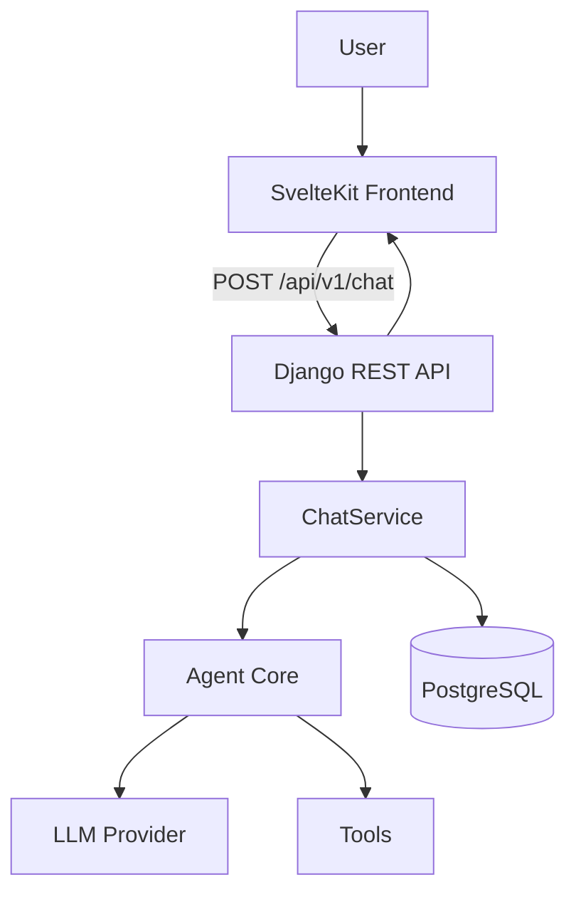

# Architecture

## Request flow



The frontend never talks to the LLM provider directly. Every request goes
through Django, which validates it, delegates to the agent, persists the
result, and returns a structured response.

## Layers

```text
View (apps/agent/views.py)
  -> Serializer (apps/agent/serializers.py)     — request/response validation
  -> Service (apps/agent/services.py)            — persistence + orchestration
  -> Agent (agent/agent.py)                      — tool-calling loop, framework-agnostic
  -> LLM Provider (agent/providers/*)            — swappable via LLM_PROVIDER env var
  -> Tools (agent/tools/*)                       — explicit, registered functions
```

`agent/` has no import of Django. It is installed as an editable local
package (`pip install -e .` from the repo root) so it can be unit-tested and
reasoned about independently of the web framework.

## Why the agent core lives outside `backend/`

The challenge requires the agent's logic not to live inside Django views,
and to be independently testable. Keeping it as its own top-level Python
package (rather than a sub-module of the Django app) makes that boundary
structural, not just a convention: `agent/` cannot import from `apps.*`
even by accident, since Django isn't a dependency of the `agent` package.

## Data model

- `Conversation` — a UUID-identified thread.
- `Message` — one turn (`user` or `assistant`) in a conversation.
- `ToolCallRecord` — one tool invocation tied to the assistant message it
  supported, with its arguments, result, and duration.

## Tool-calling loop

1. The agent sends the conversation + any tool results so far to the
   `LLMProvider` and asks: call a tool, or answer?
2. If a tool call is requested, the agent executes it (only tools in the
   explicit `TOOL_REGISTRY` can be called) and loops.
3. Once the provider returns a final answer (or a step limit is hit), the
   agent returns the answer plus the list of tool calls made, each with its
   duration in milliseconds.

See `docs/decisions.md` for the reasoning behind these choices.
